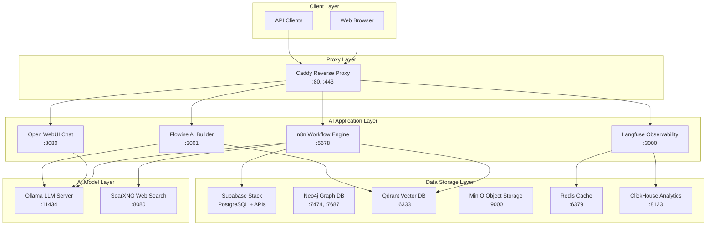

# 🏗️ Local AI Stack - Complete Architecture Reference

## 📋 Overview

This document provides a comprehensive reference for the Local AI Stack architecture - a fully self-hosted AI development environment optimized for Apple M4 Max. The stack consists of 30+ interconnected services providing LLM inference, workflow automation, vector storage, observability, and more.

---

## 🎯 Architecture Layers



---

## 🔧 Service Architecture

### **1. AI Application Services**

#### **n8n Workflow Engine** (`n8n`)
- **Purpose**: Low-code workflow automation and AI agent orchestration
- **Container**: `n8n`
- **Internal Port**: 5678
- **External Access**: `http://localhost:5678` (via Caddy)
- **Resources**: 4GB RAM, 2 CPU cores
- **Dependencies**: 
  - PostgreSQL (via Supabase) for workflow storage
  - Ollama for LLM operations
  - Qdrant for vector operations
  - SearXNG for web search
- **Key Features**:
  - 400+ integrations
  - AI agent nodes
  - Custom workflow execution
  - Webhook support

#### **Open WebUI** (`open-webui`)
- **Purpose**: ChatGPT-like interface for local LLMs
- **Container**: `open-webui`
- **Internal Port**: 8080
- **External Access**: `http://localhost:8080` (via Caddy)
- **Resources**: 2GB RAM, 1 CPU core
- **Dependencies**: 
  - Ollama for model inference
  - n8n (via pipe function) for enhanced capabilities
- **Key Features**:
  - Multi-model support
  - Custom functions
  - Chat history
  - Model management

#### **Flowise AI Builder** (`flowise`)
- **Purpose**: No-code AI agent and chatflow builder
- **Container**: `flowise`
- **Internal Port**: 3001
- **External Access**: `http://localhost:3001` (via Caddy)
- **Resources**: 2GB RAM, 1 CPU core
- **Dependencies**: 
  - Ollama for LLM operations
  - Qdrant for vector storage
- **Key Features**:
  - Visual flow builder
  - Pre-built templates
  - API integration
  - Document processing

---

### **2. AI Model & Inference Layer**

#### **Ollama LLM Server** (`ollama-cpu/gpu`)
- **Purpose**: Local LLM inference engine
- **Container**: `ollama-cpu` (optimized for M4 Max)
- **Internal Port**: 11434
- **External Access**: `http://localhost:11434` (local installation)
- **Resources**: 24GB RAM, 8 CPU cores (max allocation)
- **Models**: 
  - `qwen2.5:7b-instruct-q4_K_M` (7.6B parameters)
  - `nomic-embed-text` (137M parameters for embeddings)
- **Optimizations**:
  - Context length: 32,768 tokens
  - Flash attention enabled
  - KV cache: q8_0 quantization
  - Max loaded models: 3
  - Parallel processing: 4 requests

#### **SearXNG Web Search** (`searxng`)
- **Purpose**: Privacy-focused metasearch engine
- **Container**: `searxng`
- **Internal Port**: 8080
- **External Access**: `http://localhost:8080` (via Caddy)
- **Resources**: 1GB RAM, 0.5 CPU cores
- **Dependencies**: Redis for caching
- **Search Engines**: Google, DuckDuckGo, Bing, Brave, Startpage
- **API**: JSON format available at `/search?q=query&format=json`

---

### **3. Data Storage Layer**

#### **Supabase Stack** (Multiple Containers)
Complete database-as-a-service providing:

**Core Database** (`supabase-db`)
- **Purpose**: Primary PostgreSQL database
- **Container**: `supabase-db`
- **Internal Port**: 5432
- **Image**: `supabase/postgres:15.8.1.060`
- **Features**: pgvector, realtime, webhooks, JWT support

**API Gateway** (`supabase-kong`)
- **Purpose**: API gateway and routing
- **Container**: `supabase-kong`
- **Internal Port**: 8000
- **External Access**: `http://localhost:8000`

**Authentication** (`supabase-auth`)
- **Purpose**: User authentication and authorization
- **Container**: `supabase-auth`
- **Internal Port**: 9999
- **Features**: JWT, OAuth, magic links

**REST API** (`supabase-rest`)
- **Purpose**: Auto-generated REST API from database schema
- **Container**: `supabase-rest`
- **Internal Port**: 3000

**Realtime** (`realtime-dev.supabase-realtime`)
- **Purpose**: Real-time subscriptions and updates
- **Container**: `realtime-dev.supabase-realtime`
- **Internal Port**: 4000

**Storage** (`supabase-storage`)
- **Purpose**: File storage with image transformations
- **Container**: `supabase-storage`
- **Internal Port**: 5000

**Additional Services**:
- `supabase-studio`: Database management UI
- `supabase-meta`: Database metadata API
- `supabase-edge-functions`: Serverless functions
- `supabase-analytics`: Usage analytics
- `supabase-pooler`: Connection pooling
- `supabase-vector`: Vector operations
- `supabase-imgproxy`: Image transformations

#### **Neo4j Graph Database** (`neo4j`)
- **Purpose**: Graph database for knowledge graphs and relationships
- **Container**: `neo4j`
- **Internal Ports**: 7474 (HTTP), 7687 (Bolt)
- **External Access**: `http://localhost:7474`
- **Resources**: 3GB RAM, 1.5 CPU cores
- **Memory Configuration**:
  - Heap: 1GB initial, 2GB max
  - Page cache: 1GB
- **Use Cases**: GraphRAG, LightRAG, Graphiti knowledge graphs

#### **Qdrant Vector Database** (`qdrant`)
- **Purpose**: High-performance vector search and storage
- **Container**: `qdrant`
- **Internal Ports**: 6333 (HTTP), 6334 (gRPC)
- **External Access**: `http://localhost:6333`
- **Resources**: 4GB RAM, 2 CPU cores
- **Optimizations**:
  - Search threads: 8
  - Indexing threads: 8
- **Use Cases**: Embedding storage, semantic search, RAG

#### **MinIO Object Storage** (`minio`)
- **Purpose**: S3-compatible object storage
- **Container**: `minio`
- **Internal Ports**: 9000 (API), 9001 (Console)
- **Resources**: 1GB RAM, 0.5 CPU cores
- **Use Cases**: File storage, media assets, backups

#### **Redis Cache** (`redis`)
- **Purpose**: In-memory caching and session storage
- **Container**: `redis`
- **Internal Port**: 6379
- **Resources**: 1GB RAM, 0.5 CPU cores
- **Configuration**: 
  - Max memory: 800MB
  - Eviction policy: allkeys-lru
- **Use Cases**: Caching, session storage, pub/sub

#### **ClickHouse Analytics** (`clickhouse`)
- **Purpose**: Columnar analytics database
- **Container**: `clickhouse`
- **Internal Ports**: 8123 (HTTP), 9000 (TCP)
- **Resources**: 6GB RAM, 3 CPU cores
- **Use Cases**: LLM observability data, analytics, time-series

---

### **4. Observability & Monitoring**

#### **Langfuse Platform**
**Langfuse Web** (`langfuse-web`)
- **Purpose**: LLM observability and monitoring dashboard
- **Container**: `langfuse-web`
- **Internal Port**: 3000
- **External Access**: `http://localhost:3000` (via Caddy)
- **Resources**: 2GB RAM, 1 CPU core

**Langfuse Worker** (`langfuse-worker`)
- **Purpose**: Background processing for observability data
- **Container**: `langfuse-worker`
- **Internal Port**: 3030
- **Resources**: 2GB RAM, 1 CPU core

**Dependencies**: ClickHouse, Redis, MinIO for data storage

---

### **5. Infrastructure Layer**

#### **Caddy Reverse Proxy** (`caddy`)
- **Purpose**: Reverse proxy with automatic HTTPS
- **Container**: `caddy`
- **Ports**: 80 (HTTP), 443 (HTTPS)
- **Features**:
  - Automatic Let's Encrypt certificates
  - HTTP/2 and HTTP/3 support
  - Compression (gzip, zstd)
  - Security headers
- **Routing Configuration**:
  - `{N8N_HOSTNAME}` → n8n:5678
  - `{WEBUI_HOSTNAME}` → open-webui:8080
  - `{FLOWISE_HOSTNAME}` → flowise:3001
  - `{LANGFUSE_HOSTNAME}` → langfuse-web:3000
  - `{SUPABASE_HOSTNAME}` → kong:8000
  - `{NEO4J_HOSTNAME}` → neo4j:7474

---

## 🔄 Data Flow Patterns

### **1. Chat Interaction Flow**
```
User → Caddy → Open WebUI → Ollama → Response
                    ↓
                n8n (via pipe) → Additional Processing
```

### **2. RAG (Retrieval Augmented Generation) Flow**
```
Document → n8n → Text Processing → Embedding (Ollama) → Qdrant Storage
Query → n8n → Embedding → Qdrant Search → Context + LLM → Response
```

### **3. Web Search Enhanced Flow**
```
Query → n8n → SearXNG → Web Results → Context + LLM → Enhanced Response
```

### **4. Observability Flow**
```
LLM Interactions → Langfuse → ClickHouse Storage → Analytics Dashboard
```

### **5. Knowledge Graph Flow**
```
Data → n8n → Entity Extraction → Neo4j → Graph Relationships → Queries
```

---

## 🌐 Network Topology

### **Internal Docker Network**
All services communicate via Docker's internal network using service names:
- `http://n8n:5678`
- `http://ollama:11434` (or `http://host.docker.internal:11434` for local Ollama)
- `http://qdrant:6333`
- `http://neo4j:7474`
- `postgresql://postgres:${POSTGRES_PASSWORD}@db:5432/postgres`

### **External Access Points**
| Service | Local URL | Production Domain |
|---------|-----------|-------------------|
| n8n | http://localhost:5678 | https://n8n.yourdomain.com |
| Open WebUI | http://localhost:8080 | https://openwebui.yourdomain.com |
| Flowise | http://localhost:3001 | https://flowise.yourdomain.com |
| Langfuse | http://localhost:3000 | https://langfuse.yourdomain.com |
| Supabase | http://localhost:8000 | https://supabase.yourdomain.com |
| Neo4j | http://localhost:7474 | https://neo4j.yourdomain.com |
| SearXNG | http://localhost:8080 | https://searxng.yourdomain.com |

---

## ⚡ Performance Optimizations (M4 Max)

### **Resource Allocation Strategy**
- **High-Performance**: Ollama (24GB), ClickHouse (6GB), n8n (4GB), Qdrant (4GB)
- **Medium-Performance**: Neo4j (3GB), Open WebUI (2GB), Flowise (2GB), Langfuse (2GB each)
- **Lightweight**: Redis (1GB), MinIO (1GB), SearXNG (1GB)

### **CPU Distribution**
- **Compute-Intensive**: Ollama (8 cores), ClickHouse (3 cores)
- **Processing**: n8n (2 cores), Qdrant (2 cores)
- **Balanced**: Neo4j (1.5 cores), others (0.5-1 core)

### **Apple Silicon Optimizations**
- ARM64 container images
- Unified memory architecture utilization
- Performance/efficiency core distribution
- Native M4 Max neural engine (where supported)

---

## 🔐 Security Configuration

### **Network Security**
- Internal Docker network isolation
- Caddy reverse proxy termination
- No direct external database access

### **Authentication**
- Supabase JWT-based authentication
- Service-to-service authentication via environment variables
- Secure secret management via .env files

### **Data Protection**
- TLS encryption via Caddy
- Database encryption at rest
- Secure inter-service communication

---

## 📦 Dependencies & Startup Order

### **Startup Sequence**
1. **Infrastructure**: Redis, ClickHouse, MinIO
2. **Databases**: Supabase DB, Neo4j, Qdrant
3. **Supabase Stack**: Kong, Auth, REST, Realtime, Storage, etc.
4. **AI Services**: Ollama, SearXNG
5. **Applications**: n8n, Open WebUI, Flowise, Langfuse
6. **Proxy**: Caddy (last to ensure all upstreams available)

### **Critical Dependencies**
- **n8n** → PostgreSQL (Supabase), Ollama, Qdrant
- **Open WebUI** → Ollama
- **Flowise** → Ollama, Qdrant
- **Langfuse** → ClickHouse, Redis, MinIO
- **SearXNG** → Redis

---

## 🔧 Configuration Management

### **Environment Variables**
Configuration managed via `.env` file with sections:
- **N8N**: Encryption keys, JWT secrets
- **Supabase**: Database passwords, JWT secrets, API keys
- **Langfuse**: Encryption keys, authentication
- **Neo4j**: Authentication credentials
- **Caddy**: Domain configuration, Let's Encrypt email

### **Volume Mounts**
- **Persistent Data**: Database files, model storage, configuration
- **Shared Data**: `/data/shared` for cross-service file sharing
- **Logs**: Centralized logging via Docker volumes

---

## 🚀 Usage Patterns

### **AI Development Workflow**
1. **Data Ingestion**: Upload documents via n8n workflows
2. **Processing**: Extract text, generate embeddings, store in Qdrant
3. **Knowledge Graph**: Build relationships in Neo4j
4. **Chat Interface**: Query via Open WebUI with RAG enhancement
5. **Monitoring**: Track performance in Langfuse
6. **Search Integration**: Web-enhanced responses via SearXNG

### **Integration Points**
- **n8n ↔ Open WebUI**: Via pipe function for enhanced capabilities
- **n8n ↔ All Services**: Workflow orchestration and data processing
- **Langfuse ↔ AI Services**: Observability and performance monitoring
- **Qdrant ↔ AI Services**: Vector storage and semantic search
- **Neo4j ↔ n8n**: Knowledge graph operations

---

## 📊 Monitoring & Observability

### **Health Checks**
All services include Docker health checks for:
- Service responsiveness
- Database connectivity
- API endpoint availability

### **Logging Strategy**
- **Centralized**: Docker log driver configuration
- **Retention**: Automatic log rotation and cleanup
- **Levels**: Configurable log levels per service

### **Performance Metrics**
- **Resource Usage**: Docker stats monitoring
- **Response Times**: Service-level monitoring
- **Model Performance**: Langfuse observability
- **Database Performance**: Query performance tracking

---

## 🎯 Use Cases & Applications

### **Primary Use Cases**
1. **Local AI Development**: Build and test AI applications locally
2. **RAG Systems**: Document-based question answering
3. **AI Agents**: Autonomous task execution and workflow automation
4. **Knowledge Management**: Graph-based information organization
5. **Conversational AI**: Local ChatGPT-like experiences
6. **AI Observability**: Monitor and optimize LLM performance

### **Integration Scenarios**
- **Document Processing**: Supabase Storage → n8n → Ollama → Qdrant
- **Web-Enhanced Chat**: Open WebUI → n8n → SearXNG → Ollama
- **Knowledge Graph RAG**: Neo4j → n8n → Ollama → Structured responses
- **Multi-Modal Workflows**: Flowise visual builders → Multiple AI services

---

This architecture provides a complete, self-hosted AI development environment optimized for Apple M4 Max, enabling sophisticated AI applications while maintaining full data privacy and control.